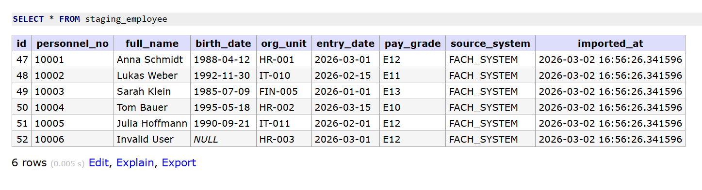
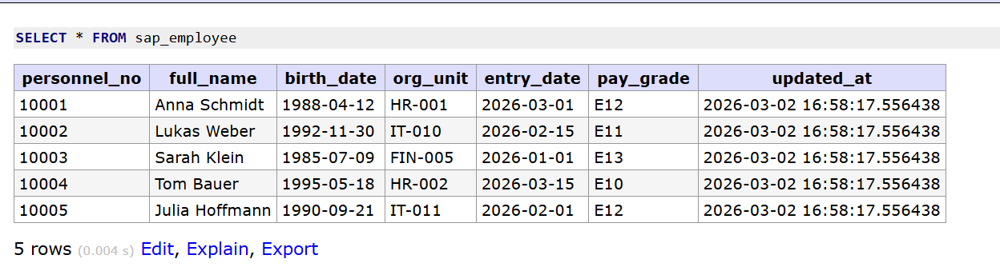
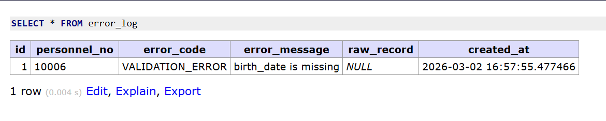

# portfolio-sap-interface-simulation

This project simulates a simple SAP interface.

Employee data from a source system is imported from a CSV file,
validated, and then transferred to a SAP target structure.

The goal of this project is to demonstrate how typical enterprise
interfaces work in real IT systems.

---

# Scenario

A source system exports employee master data as a CSV file.

The interface processes the data in several steps:

1. Import the CSV data into a **staging table**
2. Validate the data
3. Log invalid records
4. Transfer valid records to the **SAP employee table**

Invalid records are not transferred to SAP. They are stored in the `error_log` table for further analysis.

---

# Architecture

The project uses a simple interface architecture:
```
Source System (CSV)
        │
        ▼
Staging Table (PostgreSQL)
        │
        ▼
Validation Logic (SQL)
        │
        ├── Valid records → SAP Employee Table
        │
        └── Invalid records → Error Log
```
---

# Technologies

This project uses the following technologies:

- Docker
- PostgreSQL
- Adminer
- SQL
- CSV file interface

---

# Database Tables

### staging_employee

Stores raw incoming data from the source system.

The staging table allows incomplete or invalid data.
This is common in real interface systems.

---

### sap_employee

Represents the SAP employee master data table.

Only valid data is transferred to this table.

---

### error_log

Stores invalid records and validation errors.

This helps with troubleshooting and data correction.

---

# Data Flow
```
CSV file  
→ staging_employee  
→ validation logic  
→ sap_employee (valid records)  
→ error_log (invalid records)
```
---

# Example Execution

The following screenshots show the result of the interface process.

**Staging Table (Raw Data)**

The staging table stores all incoming data from the source system.




**SAP Employee Table (Valid Records)**

Only valid records are transferred to the SAP target table.




**Error Log (Invalid Records)**

Invalid records are stored in the error log.



---

# Operations Concept

The interface is executed as a batch process.

1st Level Support:
Monitors the interface execution and checks if new data has been imported.

2nd Level Support:
Analyzes validation errors and database logs.

Monitoring:
The staging_employee and error_log tables are checked regularly.

Incident Handling:
Invalid records are written to the error_log table and can be analyzed by support teams.

---

# How to Run

Start the database environment:
```
docker compose up -d
```

Open Adminer in the browser:

```
http://localhost:8080
```
Login:
```
System: PostgreSQL
Server: postgres
User: demo
Password: demo
Database: sap_sim
```
---

# Project Goal

This portfolio project demonstrates:

- SAP interface concepts
- staging table architecture
- validation logic
- error handling
- data integration workflow

The architecture reflects patterns used in real enterprise integration systems.

## Project Structure

portfolio-sap-interface-simulation

```
│   docker-compose.yml
│   README.md
│
├───data
│   └───inbound
│           employees.csv
│
├───db
│   └───init
│           01_schema.sql
│           02_load.sql
│           03_validate_and_transfer.sql
│
├───docs
│   │   incident_example.md
│   │
│   └───screenshots
│           error_log.png
│           sap.png
│           staging.png
│

```
